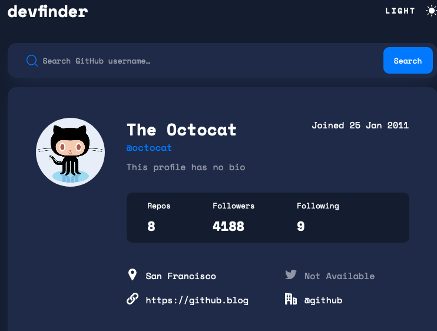

# Frontend Mentor - GitHub user search app solution

This is a solution to the [GitHub user search app challenge on Frontend Mentor](https://www.frontendmentor.io/challenges/github-user-search-app-Q09YOgaH6). Frontend Mentor challenges help you improve your coding skills by building realistic projects.

## Table of contents

- [Overview](#overview)
  - [The challenge](#the-challenge)
  - [Screenshot](#screenshot)
  - [Links](#links)
- [My process](#my-process)
  - [Built with](#built-with)
  - [What I learned](#what-i-learned)
  - [Continued development](#continued-development)
  - [Useful resources](#useful-resources)
- [Author](#author)
- [Acknowledgments](#acknowledgments)

## Overview

### The challenge

Users should be able to:

- View the optimal layout for the app depending on their device's screen size
- See hover states for all interactive elements on the page
- Search for GitHub users by their username
- See relevant user information based on their search
- Switch between light and dark themes
- **Bonus**: Have the correct color scheme chosen for them based on their computer preferences. _Hint_: Research `prefers-color-scheme` in CSS.

### Screenshot

### Links (TODO)

- Solution URL: [Add solution URL here](https://your-solution-url.com)
- Live Site URL: [https://AndrewHuntington.github.io/github-user-search](https://AndrewHuntington.github.io/github-user-search)

## My process

### Built with

- HTML5 markup
- CSS custom properties
- Flexbox
- TypeScript
- Mobile-first workflow
- Git
- [React](https://reactjs.org/) - JS library
- React Hooks
- [Axios Hooks](https://github.com/simoneb/axios-hooks) - For API requests
- [React Hook Form](https://react-hook-form.com/) - For handling input

**Note: These are just examples. Delete this note and replace the list above with your own choices**

### What I learned (TODO)

This project is the first one where I added a way to switch to dark mode. (Type more later...)

### Continued development (TODO)

- Problems with Context
- Still learning to use TypeScript

### Useful resources (TODO)

- [Example resource 1](https://www.example.com) - This helped me for XYZ reason. I really liked this pattern and will use it going forward.
- [Example resource 2](https://www.example.com) - This is an amazing article which helped me finally understand XYZ. I'd recommend it to anyone still learning this concept.

**Note: Delete this note and replace the list above with resources that helped you during the challenge. These could come in handy for anyone viewing your solution or for yourself when you look back on this project in the future.**

## Author

- Website - [Andrew Huntington](https://www.AndrewHuntington.com)
- Frontend Mentor - [@yourusername](https://www.frontendmentor.io/profile/yourusername)

## Acknowledgments (TODO)

This is where you can give a hat tip to anyone who helped you out on this project. Perhaps you worked in a team or got some inspiration from someone else's solution. This is the perfect place to give them some credit.

**Note: Delete this note and edit this section's content as necessary. If you completed this challenge by yourself, feel free to delete this section entirely.**
